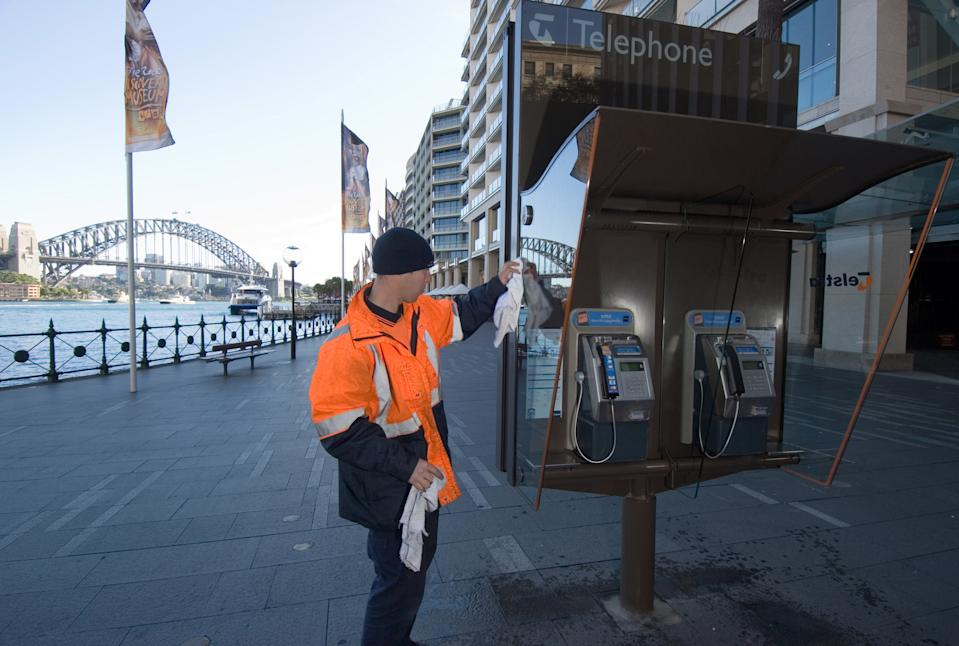
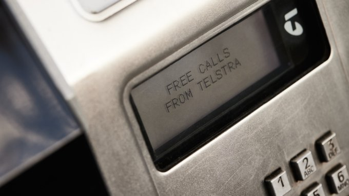
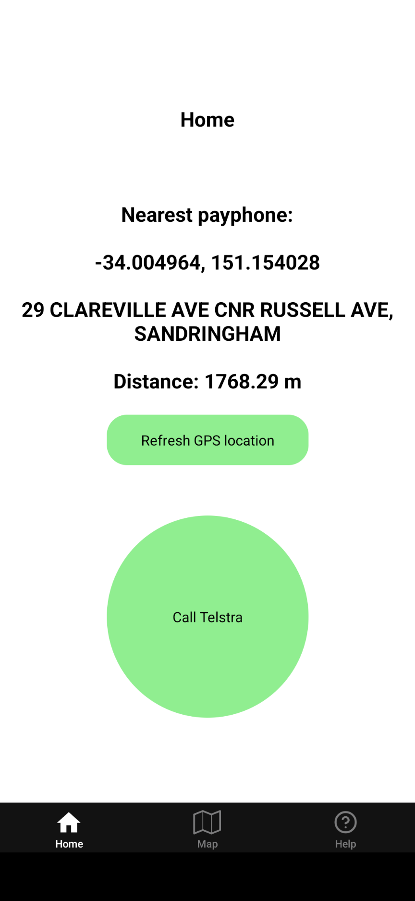
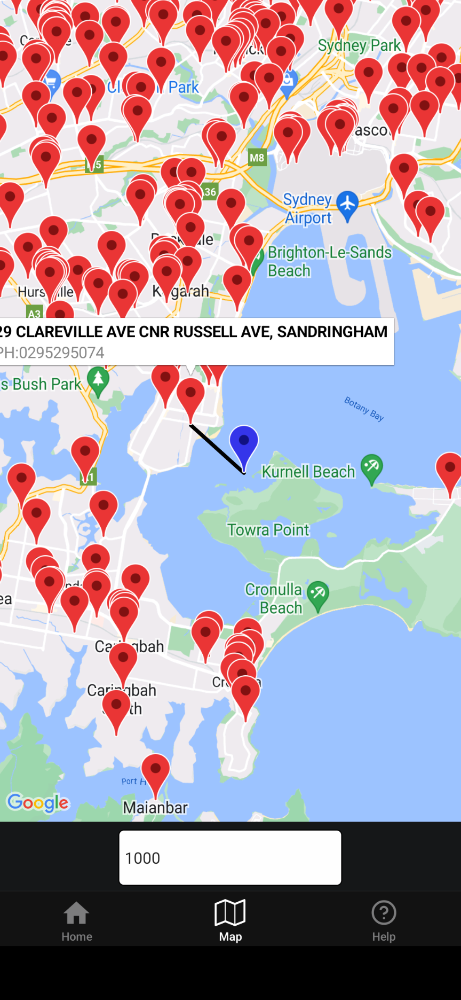
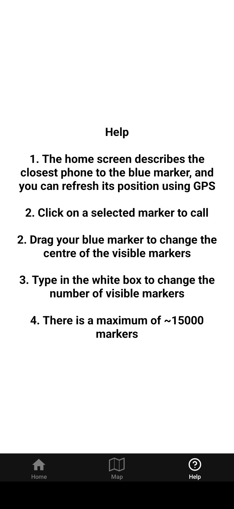

## Telstra Caller App

# Overview and Context
There are ~15,000 of Telstra payphones set up across Australia, featured everywhere
from dense city to regional roads. A few years ago, all phone calls made from these payphones
were made completely free to anyone who needs them, and many of them are even equipped with free wifi!

This app allows people to interactively locate or call the payphones closest to them, which 
should help in the case of a future phone battery emergency or emergency-emergency.

# Features
- Quickly find and call the nearest payphone to your GPS location 
- Browse around for other payphones in the map section
- [Data downloaded courtesy of information courtesy of the Telstra API](https://www.telstra.com.au/find-us)

# Images

# To use:
Download and install the APK from the releases section!